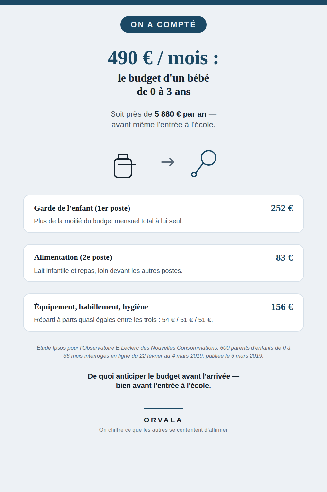

# Combien coûte un bébé, par mois ?

**490 €** : c'est le budget mensuel moyen que les parents français consacrent à un enfant de 0 à 3
ans — soit près de **5 880 € par an**, avant même l'entrée à l'école.

## La décomposition

| Poste | Chiffre |
|---|---|
| Budget mensuel moyen | **490 €** |
| Garde de l'enfant (1er poste) | **252 €** — plus de la moitié du total |
| Alimentation (2e poste) | **83 €** |
| Équipement | **54 €** |
| Habillement | **51 €** |
| Hygiène / bien-être | **51 €** |

Note honnête : la somme des 5 postes détaillés (252 + 83 + 54 + 51 + 51) fait **491 €**, contre un
total de **490 €** annoncé par l'étude elle-même. Cet écart d'1 € existe dans la source d'origine
(arrondis indépendants par poste) — il n'a été ni corrigé ni recalculé ici, pour rester fidèle au
chiffre publié.

## La source

Étude **Ipsos pour l'Observatoire E.Leclerc des Nouvelles Consommations**, questionnaire en ligne
auprès de **600 parents** d'enfants de 0 à 36 mois résidant en France, terrain du **22 février au
4 mars 2019**, publiée le **6 mars 2019**.

Pages source vérifiées directement :
- https://www.ipsos.com/fr-fr/larrivee-dun-enfant-greve-le-pouvoir-dachat-des-francais-un-budget-estime-pres-de-500-euros-par
- https://www.mouvement.leclerc/espace-presse/larrivee-dun-enfant-greve-le-pouvoir-dachat-des-francais-un-budget-estime-pres-de-500

Aucun chiffre de ce document n'a été recalculé ou extrapolé, à l'exception du total annuel
(490 × 12 = 5 880 €), un calcul simple et transparent. L'étude date de 2019 : c'est la source
primaire la plus solide trouvée à ce jour pour ce sujet, présentée comme telle plutôt que comme un
chiffre d'actualité.

## Ce que ce chiffre ne dit pas

Ce contenu porte uniquement sur la **dépense**, jamais sur le sommeil, la santé ou l'éducation du
nourrisson. Il ne contient aucun conseil parental ni médical — seulement un chiffre, sa
décomposition et sa source, pour celles et ceux qui veulent situer leur propre budget avant
l'arrivée d'un enfant.

## À propos

Ce dépôt accompagne une épingle Pinterest (compte `orvaladigital`). Contrairement aux six sujets
précédents de cette série (« On a compté »), il est publié en **dépôt** et non en pari formalisé :
le portefeuille de paris actifs d'Astréa est au plafond (6/6) au moment de la publication. Ce
contenu n'a donc ni fenêtre de mesure ni critère de kill écrit — il reste en ligne et pourra devenir
un pari à part entière dès qu'une place se libère.

## La série « On a compté »

**Toute la série, avec un chiffre-titre par sujet** : [github.com/VincentChabran](https://github.com/VincentChabran)

Ce dépôt fait partie d'une série qui chiffre et source ce que les autres se contentent d'affirmer, un sujet à la fois :

- [783 €/an pour un chien, 571 €/an pour un chat](https://github.com/VincentChabran/combien-coute-un-chien-un-chat)
- [19 293 € : le budget moyen d'un mariage en France](https://github.com/VincentChabran/combien-coute-un-mariage)
- [1 239,56 € : le coût de revient d'un déménagement de 27 m³](https://github.com/VincentChabran/combien-coute-un-demenagement)
- [488 € : le budget d'une rentrée scolaire 2026](https://github.com/VincentChabran/combien-coute-une-rentree-scolaire)
- [1 748 € : le budget des vacances d'été 2026](https://github.com/VincentChabran/combien-coutent-des-vacances-ete)
- [491 € : le budget de Noël 2025](https://github.com/VincentChabran/combien-coute-noel)
